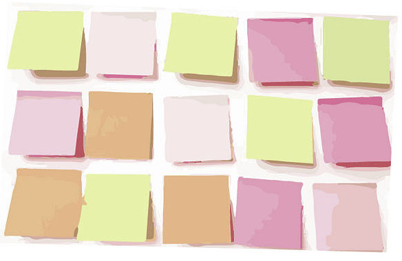
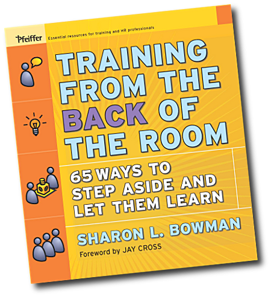
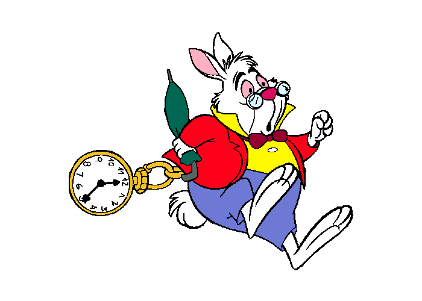

## Share your **warm-up answers** with **3 people**
### (3 things you know about UX)
### (1 example each of good UX, bad UX)

^ take notes on similarities

---

## **Similarities** in warm-up answers?

^ * UX covers many areas
* prototyping, testing with users
* usable, useful, enjoyable
* from the start, and during
* user-centered

---

## Your **name** on the back
## **1 question** about UX on the front
## Pick **someone else's card**, answer the question

^ Questionable card swap
Keep your own card for later

---

## Help! The UX Designer isn't coming in today!
## **ctfeds.org/help**

^ Materials will be up there in the next day or

---

# **BIG** FACES

 

^ Introduce each other:
name, job, company, experience (?)

——

### Agenda

## The **case study**
## Find and **sketch** solutions
## Leave with **SMART goal**

^ high-level principles
Specific, Measurable, Achievable, Realistic, Time-bound

---

^ Sharon Bowman
there will be WALKING

---

# Tight Ship

^ Tight on time
But don't stress!

---

# Presentation:
# Case Study

---

### Gallery Walk

## Walk around and **write ideas for solutions**

^ a poster per screen
based on principles

---

# Poster Talk

^ then Jen re prioritisation

---

### Solutions

## **Sketch** new ideas
## **Annotate** existing

^ Solo, 15m
Then share with table

---

### Solutions

## **Share** with table
## **Annotate** your own

^ 15m, so just a minute or two each
go left

---

### Questionable cards (the remix)

## Write **your own answer** to your original question

^ could be same
probably different

---

## Grab a **card**
## Write a **SMART goal**

### Specific, Measurable, Achievable, Realistic, Time-bound

^ Closing time
Before next meetup.
Something you're going to differently.
"Be gooder" nope. "Read 3 articles by Tuesday" yep.

---

### Facilitator feedback

## Grab another **card**
## Write down one thing we could **do differently next time**

^ Facilitator feedback

---

### Bye! Don't forget to grab the

## Principles Handout

### on your way out

### and look at **ctfeds.org/help**

